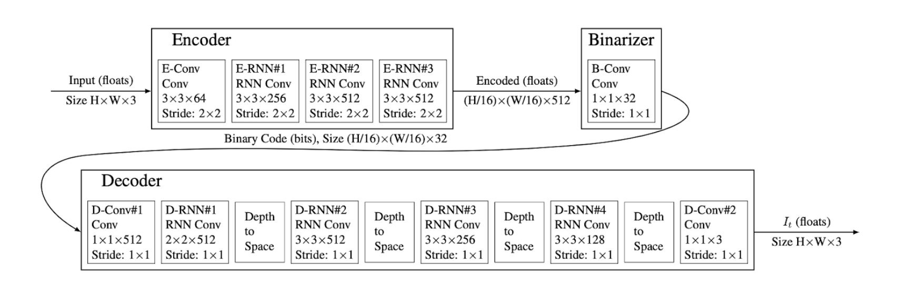
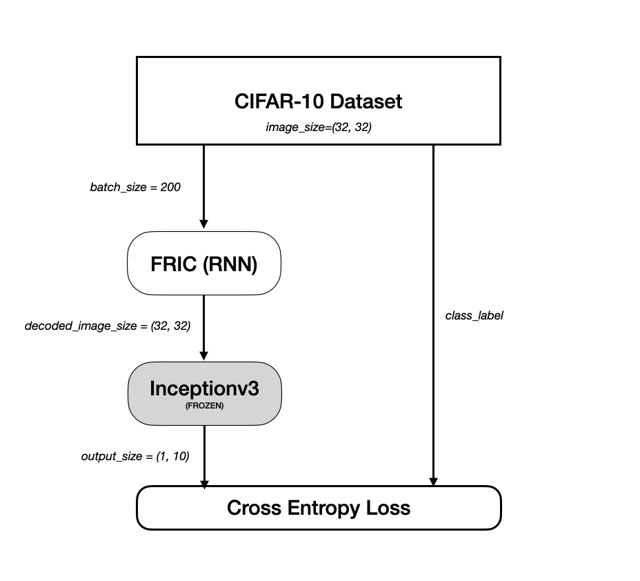
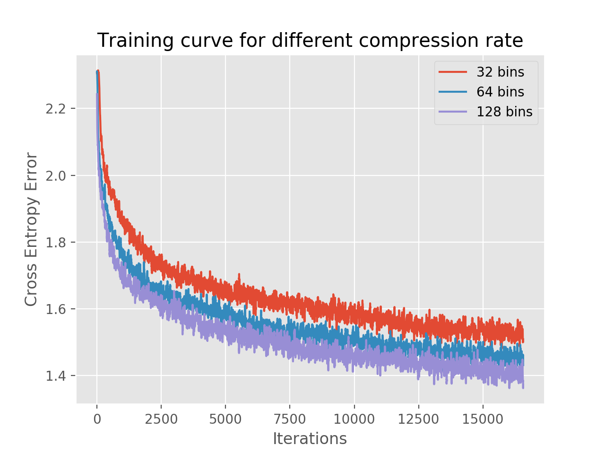
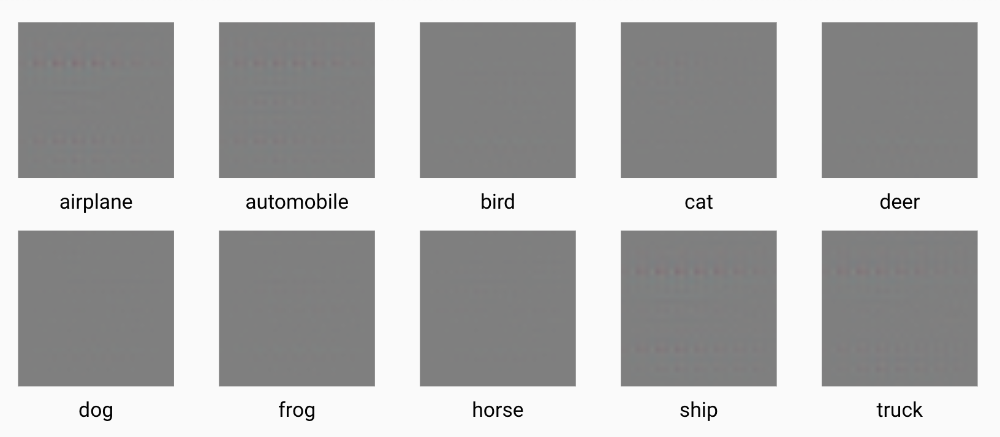
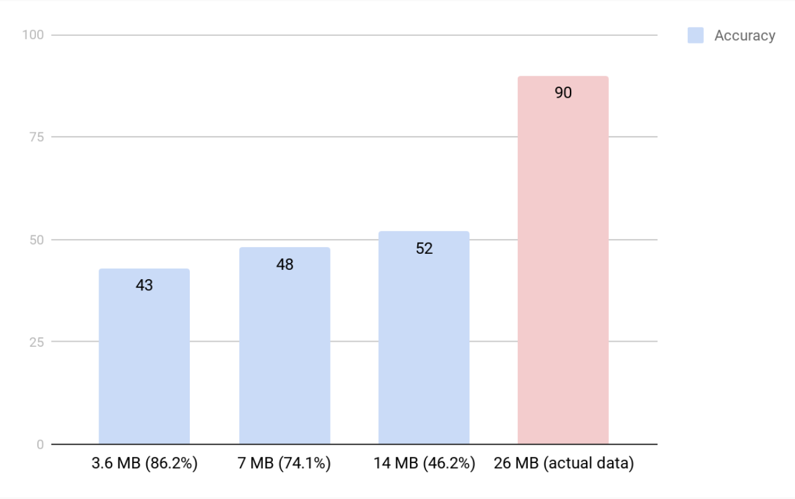

Our objective is to achieve higher compression in images by retaining only the essential features that are useful to a given computer vision system. For instance, given a computer vision system like VGG16 (a state of the art object detection neural network), the modified image compression technique should produce a compressed image that is sufficient enough for the VGG16 to detect the semantically important objects. We proposed two such approaches -

    * Depth map based JPEG encoder (d-JPEG)
    * Image Compression for Object Detection (VGG-Compression)

# Depth map based JPEG encoder (d-JPEG)

In the work Semantic Perceptual Image Compression using Deep Convolution Networks (DCC, 2017), they encode semantically-salient regions of the image with higher quality than the other regions. We try to extend this idea by using depth estimate map of the image. We use Dense depth \cite{alhashim2018high} to get the depth map to encode the regions that are closer to the camera with higher quality than the regions that are far away. The intuition for this approach is that the regions that are closer to the camera are likely to be more important for the end object detection system than the regions that are far away.

The motivation for this approach of using the depth based map instead of the existing approach using the semantically important region is that the depth estimation can be done with better accuracy and efficiency than finding out semantically important region in an image. There are lots of classical algorithms that are available to estimate the depth in the image which can be done with less compute power. However, to start with we have used a pre-trained model for depth estimation, and in the future we will try to compare it with the existing classical algorithms for depth estimation. 

The key contribution of this approach are,

* Use of depth map to do non uniform image compression on the image.
* Median filter on the depth map and using it along with the existing percentile based multi-level thresholding to create regions in the depth map.
* Doing the compression to the extent in which the important information near to the camera like text or numbers are still recognizable by the computer vision system.

## Design (Depth based approach)

### Depth Estimator
We used the dense depth from High Quality Monocular Depth Estimation via Transfer Learning  - 2018
 and model trained on NYU Depth v2 dataset to generate a depth map for the given input image. It uses convolutional neural network (CNN) for computing a high-resolution depth map and the model that we used was trained using NYU Depth v2 dataset.

The input for the module is the original image and the output from this module is the depth map of the image in gray-scale.

### Median Filter

Before using the depth map for the image compression, we wrote an additional layer to smoothen the depth map using the median filter. This is used so that map has proper regions of varying depth, and it useful so that for these individual regions a uniform compression can be used.

### Image Combiner

We reused the image combiner module from  Semantic Perceptual Image Compression using Deep Convolution Networks (DCC, 2017) with minor modification. The image combiner uses the list of compressed images with varied compression ratio to use that as  segment for various regions in the depth map.

We have tweaked the existing model based on percentile based multi-level threshold in the combiner for our needs to identify the segments in the depth and use the corresponding compressed image segment. 

## Evaluation for depth based compression (d-JPEG)

* Dataset - Street View Text (SVT) extracted from Google Street View 
350 images (images containing text in it). Text is one of the finer and important detail  that can be present in the image. Our compression method should not lose this information.

* Computer Vision System - EAST (An Efficient Accurate Scene Text Detector - CVPR ‘17) 

This table shows the file size savings got from the d-JPEG compression,

<table>
<tr><th> MIN</th><th> MAX </th><th> AVG </th></tr>
   <tr><td>3.05%</td><td> 27.57% </td><td> 14.59% </td></tr>
   </table>

The average file size savings of **14.59%**.

**We measured the accuracy by comparing the number of rectangles around the text the EAST is able to annotate both on the original and the compressed image.**

This table shows the accuracy based on the EAST's text detection on d-JPEG compression,

<table>
  <tr><th> Metric </th> <th> Value </th> </tr>
<tr><td> Accuracy  </td><td> 84.28% </td></tr>
</table>

  

    
  

  

    
  

<table>
  <tr>
    <td>Compressed Image
</td>
    <td>Original Image
</td>
  </tr>
  <tr>
   <td>
    </img> </td> <td>
    </img></td>
  
  </tr>
 </table>
   
 The figures shown in the above table contains the image with maximum savings of 27.57%.
 As you could see from the above table, the EAST is able to detect the text in the compressed image in the same way as the original image. 

# Image Compression for Object Detection

In this approach, we take a computer vision system and learn an image compression encoding/decoding specific to it. For instance, given a computer vision system like Inception v3 (a state of the art object detection neural network), the modified image compression scheme should produce a compressed image that is sufficient enough for the Inception v3 to detect objects.

To achieve this we need a better Encoding/Decoding scheme than JPEG. We propose a way to learn a encoding/decoding scheme for a specific computer vision system. Here, we train an encoding/decoding scheme for Inception v3 using neural network proposed in Full Resolution Image Compression by Toderici et. al.

## Full Resolution Image Compression

The network has three components -

1. Encoder - Takes the RGB image as input and produces an encoded version of it.
2. Binarizer - Takes the encoded image as input and produces the compressed version of the image. The output size of Binarizer determines the compressed image size.
3. Decoder - Taes the compressed image and reconstructs the original image while retaining the important features.

## Design

The image shows a high level design of the system. We use [CIFAR-10 Dataset](http://www.cs.toronto.edu/~kriz/cifar.html) to train the network. The images of batch size 200 go through the FRIC network that compresses and reconstructs the image. The reconstructed image is fed into the trained inception v3 network that predicts the class label for the image. Using the predicted class label and the ground truth label we get the cross entropy loss. We use the gradient of cross entropy loss and backpropagation to update the parameters of FRIC network. During backpropagation the parameters of Inception v3 are not updated.

## Dataset

We used [CIFAR-10 Dataset](http://www.cs.toronto.edu/~kriz/cifar.html) that contains 50,000 training images of size 32x32 and from 10 object classes. During training we used a batch size of 200 and a learning rate of 5e-5. FRIC network was originally designed to take 32x32 images as input and that is why we chose this dataset. Our trained inception v3 model achieves a test set accuracy of about 90% for this dataset.

## Training Curve

We have plotted training loss vs iterations for three trained models with varying compression rate. Compression rate is controlled by the output size from the Binarizer of FRIC network. The three curves corresponds to a particular compression rate. Higher the compression rate the higher is the loss during training. This suggests a trade off between accuracy and the compression rate.

## Results

The output of this compression scheme that was leanrt using an object detection system need not be visually perceivable by humans. The object detection system retains the important abstract features that are need for object classification and remove unwanted details so that we can achieve a high compression rate.

In the above image we can see that all the images look like gray tiles. For humans, the images may look random and meaningless while for an object detection network like Inception v3 it is easy to classify them info the corresponding obejct classes.

## Evaluation

This is a plot showing how compression rate affects accuracy of prediction. The total size of the test data is 26 MB and the Inception v3 model classifies objects with 90% accuracy. When we tune the compression rate to 46.2% we see that the accuracy drops to 52% and when the compression rate is pushed to 86.2% we see that the accuracy further drops to 43% which is still a lot better than a random object classifier that would have an accuracy of 10%.

